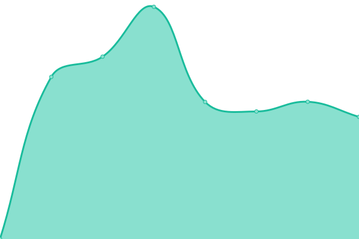

# [📈 Live Status](https://RealDigitalExperiences.github.io/site-monitor-upptime): <!--live status--> **🟧 Partial outage**

This repository contains the open-source uptime monitor and status page for [RealDigitalExperiences](https://RealDigitalExperiences.github.io/site-monitor-upptime), powered by [Upptime](https://github.com/upptime/upptime).

With [Upptime](https://upptime.js.org), you can get your own unlimited and free uptime monitor and status page, powered entirely by a GitHub repository. We use [Issues](https://github.com/RealDigitalExperiences/site-monitor-upptime/issues) as incident reports, [Actions](https://github.com/RealDigitalExperiences/site-monitor-upptime/actions) as uptime monitors, and [Pages](https://RealDigitalExperiences.github.io/site-monitor-upptime) for the status page.

<!--start: status pages-->
<!-- This summary is generated by Upptime (https://github.com/upptime/upptime) -->
<!-- Do not edit this manually, your changes will be overwritten -->
<!-- prettier-ignore -->
| URL | Status | History | Response Time | Uptime |
| --- | ------ | ------- | ------------- | ------ |
|  [Badinage](https://badinage.co.za/) | 🟩 Up | [badinage.yml](https://github.com/RealDigitalExperiences/site-monitor-upptime/commits/HEAD/history/badinage.yml) | 

 383ms
     
 | 

<a href="https://RealDigitalExperiences.github.io/site-monitor-upptime/history/badinage">100.00%</a>
    

|  [Zeebab](https://www.zeebab.co.za) | 🟩 Up | [zeebab.yml](https://github.com/RealDigitalExperiences/site-monitor-upptime/commits/HEAD/history/zeebab.yml) | 

 815ms
     
 | 

<a href="https://RealDigitalExperiences.github.io/site-monitor-upptime/history/zeebab">100.00%</a>
    

|  [Hennies](https://www.therealhennies.co.za) | 🟩 Up | [hennies.yml](https://github.com/RealDigitalExperiences/site-monitor-upptime/commits/HEAD/history/hennies.yml) | 

 7670ms
     
 | 

<a href="https://RealDigitalExperiences.github.io/site-monitor-upptime/history/hennies">100.00%</a>
    

|  [Yellow Fat media](https://yellowfatmedia.com) | 🟥 Down | [yellow-fat-media.yml](https://github.com/RealDigitalExperiences/site-monitor-upptime/commits/HEAD/history/yellow-fat-media.yml) | 

 522ms
     
 | 

<a href="https://RealDigitalExperiences.github.io/site-monitor-upptime/history/yellow-fat-media">99.80%</a>
    

|  [Gallaron](https://earnest-hamster-6fd4cb.netlify.app/) | 🟩 Up | [gallaron.yml](https://github.com/RealDigitalExperiences/site-monitor-upptime/commits/HEAD/history/gallaron.yml) | 

 51ms
     
 | 

<a href="https://RealDigitalExperiences.github.io/site-monitor-upptime/history/gallaron">100.00%</a>
    

|  [Ohkayi](https://ohkayi.com) | 🟩 Up | [ohkayi.yml](https://github.com/RealDigitalExperiences/site-monitor-upptime/commits/HEAD/history/ohkayi.yml) | 

 924ms
     
 | 

<a href="https://RealDigitalExperiences.github.io/site-monitor-upptime/history/ohkayi">100.00%</a>
    

|  [Hennies Zeebab Branches](https://branches.therealhennies.co.za) | 🟩 Up | [hennies-zeebab-branches.yml](https://github.com/RealDigitalExperiences/site-monitor-upptime/commits/HEAD/history/hennies-zeebab-branches.yml) | 

 798ms
     
 | 

<a href="https://RealDigitalExperiences.github.io/site-monitor-upptime/history/hennies-zeebab-branches">100.00%</a>
    

|  [Zeebab Hennies](https://hennies.zeebab.co.za/login) | 🟩 Up | [zeebab-hennies.yml](https://github.com/RealDigitalExperiences/site-monitor-upptime/commits/HEAD/history/zeebab-hennies.yml) | 

 147ms
     
 | 

<a href="https://RealDigitalExperiences.github.io/site-monitor-upptime/history/zeebab-hennies">100.00%</a>
    

|  [Zeebab Forest Energy](https://forestenergy.zeebab.co.za/login) | 🟩 Up | [zeebab-forest-energy.yml](https://github.com/RealDigitalExperiences/site-monitor-upptime/commits/HEAD/history/zeebab-forest-energy.yml) | 

 202ms
     
 | 

<a href="https://RealDigitalExperiences.github.io/site-monitor-upptime/history/zeebab-forest-energy">100.00%</a>
    

<!--end: status pages-->

[**Visit our status website →**](https://RealDigitalExperiences.github.io/site-monitor-upptime)

## 📄 License

- Powered by: [Upptime](https://github.com/upptime/upptime)
- Code: [MIT](./LICENSE) © [RealDigitalExperiences](https://RealDigitalExperiences.github.io/site-monitor-upptime)
- Data in the `./history` directory: [Open Database License](https://opendatacommons.org/licenses/odbl/1-0/)
